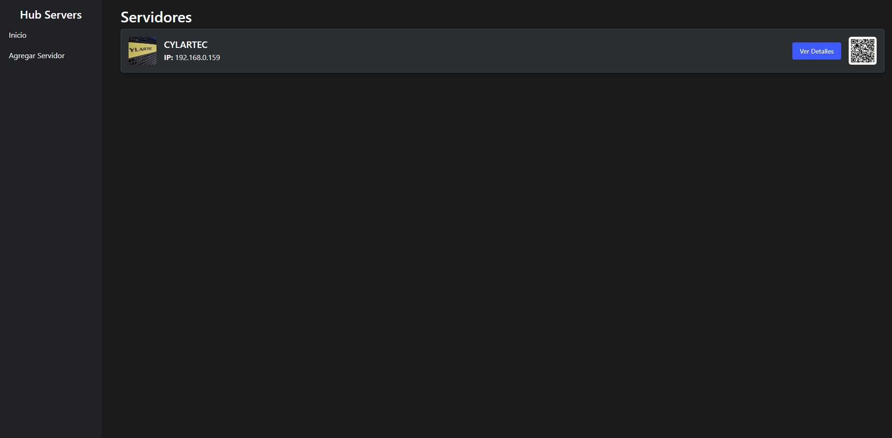
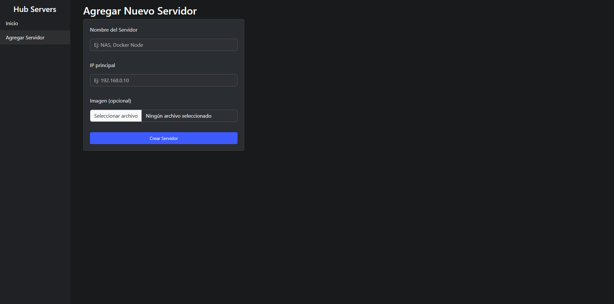
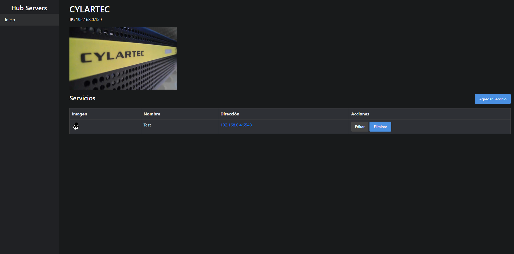
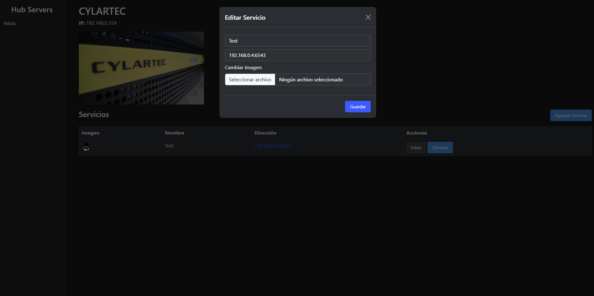

# HubServer 

**HubServer** es una aplicación web para visualizar, administrar y documentar múltiples servidores locales o remotos, junto con sus servicios asociados. Diseñada para entornos técnicos como laboratorios caseros, redes de desarrollo, servidores Docker, Proxmox, Kubernetes, NAS y más.

Su diseño está inspirado en herramientas como Portainer, soporte para imágenes, CRUD completo y generación de códigos QR para acceder rápidamente desde el móvil.

---

## ¿Qué puedo hacer con HubServer?

- Registrar **múltiples servidores** en red con nombre, IP principal e imagen personalizada.
- Asociar a cada servidor uno o más **servicios** (por ejemplo: interfaces web, APIs, paneles, etc.).
- Subir imágenes opcionales para representar cada **servicio**.
- Acceder a cada servicio desde un **link clickeable** (IP:puerto).
- **Editar o eliminar** servicios directamente desde una interfaz amigable.
- Generar **códigos QR** por servidor para acceder rápidamente desde un smartphone.
- Todo esto, **sin necesidad de base de datos**, solo con `data.json`.

---

## Capturas de Pantalla

### Vista principal: listado de servidores
  Aqui podemos ver el listado de los servidores.


### Agregar servidor
  Aqui agregamos los servers que querramos con su IP y su imagen si queremos y nos generara un QR que el escanearlo nos envia directo a los detalles internos.


### Vista de un servidor y sus servicios
  Aqui apareceremos al escanear el QR y podemos agregar los servicios que tengamos dentro del servidor.


### Modal de edición de servicios
  Si nos equivocamos o debemos modificar algo se puede hacer desde el boton de edicion o podemos borrarlo si queremos.


---

## Tecnologías Utilizadas

- **Python 3.11**
- **Flask** como framework web
- **Bootstrap 5.3**
- **Docker** y **Docker Compose** para despliegue fácil
- **QRCode** (librería `qrcode`) para generación de códigos QR
- Almacenamiento en archivo JSON (sin base de datos)

---
###  1. Clona el repositorio y despliega con Docker (persistente)

```bash
git clone https://github.com/tuusuario/HubServer.git
cd HubServer
```

###  2. Levanta la aplicación de forma persistente

```bash
docker-compose up -d
```

>  Este comando:
> - Construye la imagen si es la primera vez.
> - Crea los volúmenes para guardar tus datos e imágenes.
> - Levanta el servidor Flask en el puerto `15000`.
> - **Y si el equipo se reinicia, el contenedor vuelve a arrancar automáticamente** gracias a `restart: always` en el `docker-compose.yml`.

### Persistencia de datos garantizada

- Todos los datos se guardan en:
  - `data.json` → base del sistema.
  - `static/images/` → imágenes de los servidores.
  - `static/service_icons/` → íconos personalizados de los servicios.

 **Nada se borra** al apagar el contenedor o reiniciar el host, porque estos directorios están montados como volúmenes.

### Asegurar que Docker arranque con el sistema

```bash
sudo systemctl enable docker
```

